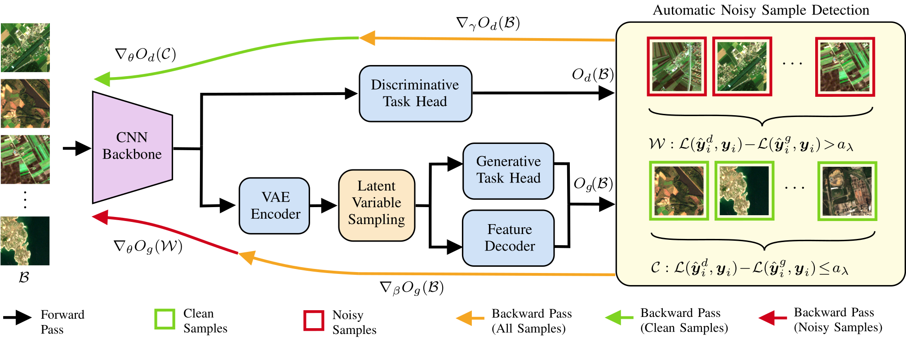

# Generative Reasoning Integrated Label Noise Robust Deep Image Representation Learning
This repository contains code of the paper [`Generative Reasoning Integrated Label Noise Robust Deep Image Representation Learning`](https://arxiv.org/abs/2212.01261) under revision at IEEE Transactions on Image Processing. This work has been done at the [Remote Sensing Image Analysis group](https://www.rsim.tu-berlin.de/menue/remote_sensing_image_analysis_group/) by [Gencer Sumbul](http://www.user.tu-berlin.de/gencersumbul/) and [Begüm Demir](https://begumdemir.com/).

If you use this code, please cite our paper given below:

> G. Sumbul and B. Demіr, "Generative Reasoning Integrated Label Noise Robust Deep Image Representation Learning", IEEE Transactions on Image Processing, Under Review, 2023.

```
@article{GRID,
  author={G. {Sumbul} and B. {Demіr}},
  booktitle={IEEE Transactions on Image Processing}, 
  title={Generative Reasoning Integrated Label Noise Robust Deep Image Representation Learning}, 
  year={2023},
  note={Under Review}
}

```



## Prerequisites
* The code in this repository is tested with Python 3.8.10 and TensorFlow 2.8.0, along with a number of packages, which are given in requirements.txt. The datasets need to be prepared beforehand as described below. Currently, this code is suitable to use with [DLRSD](https://sites.google.com/view/zhouwx/dataset#h.p_hQS2jYeaFpV0) and [BigEarthNet](http://bigearth.net/) benchmark archives.
* To use the DLRSD benchmark archive, corresponding `TFRecord` files for training/val/test splits should be first prepared after downloading the raw images from [here](http://weegee.vision.ucmerced.edu/datasets/landuse.html) and corresponding multi-labels from [here](https://drive.google.com/file/d/1DtKiauowCB0ykjFe8v0OVvT76rEfOk0v/view?usp=sharing). The `prep_DLRSD_noisy.py` script can be used for this purpose. 
* To use the BigEarthNet benchmark archive, corresponding `TFRecord` files for training/val/test splits should be first prepared after downloading the raw images and multi-labels from [here](https://bigearth.net/#downloads). The `prep_BEN_noisy.py` script can be used for this purpose. It is noted that only GRID (BCE) can be used with BigEarthNet since land-cover maps of its images are not publicly available yet.  

## Training
The script `train.py` expects a `JSON` configuration file path as a comand line argument. Three configuration files are given as examples. Once the training is done, TensorFlow summaries, model weights and the final `JSON` file keeping all the configurations are saved under `dumps` folder. 

## Retrieval
The script `retrieval.py` expects the `JSON` configuration file path as a comand line argument. After the training is finished, corresponding configuration file is saved under `dumps/configs/`. This file can be direclty used for retrieval.

## Authors
**Gencer Sümbül**
http://www.user.tu-berlin.de/gencersumbul/


## License
The code in this repository to facilitate the use of the `Generative Reasoning Integrated Label Noise Robust Deep Image Representation Learning` is licensed under the **MIT License**:

```
MIT License

Copyright (c) 2023 The Authors of The Paper, "Generative Reasoning Integrated Label Noise Robust Deep Image Representation Learning"

Permission is hereby granted, free of charge, to any person obtaining a copy
of this software and associated documentation files (the "Software"), to deal
in the Software without restriction, including without limitation the rights
to use, copy, modify, merge, publish, distribute, sublicense, and/or sell
copies of the Software, and to permit persons to whom the Software is
furnished to do so, subject to the following conditions:

The above copyright notice and this permission notice shall be included in all
copies or substantial portions of the Software.

THE SOFTWARE IS PROVIDED "AS IS", WITHOUT WARRANTY OF ANY KIND, EXPRESS OR
IMPLIED, INCLUDING BUT NOT LIMITED TO THE WARRANTIES OF MERCHANTABILITY,
FITNESS FOR A PARTICULAR PURPOSE AND NONINFRINGEMENT. IN NO EVENT SHALL THE
AUTHORS OR COPYRIGHT HOLDERS BE LIABLE FOR ANY CLAIM, DAMAGES OR OTHER
LIABILITY, WHETHER IN AN ACTION OF CONTRACT, TORT OR OTHERWISE, ARISING FROM,
OUT OF OR IN CONNECTION WITH THE SOFTWARE OR THE USE OR OTHER DEALINGS IN THE
SOFTWARE.
```
